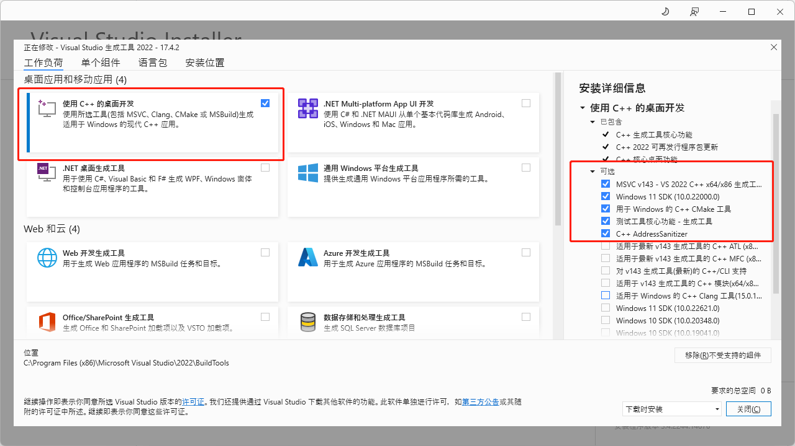

## start

## 环境准备
1. `window`需要安装[visual-cpp-build-tools](https://visualstudio.microsoft.com/zh-hans/visual-cpp-build-tools/)
](image.png)
2. 电脑需要安装 [rust](https://www.rust-lang.org/zh-CN/tools/install)
3. 安装最新[webview2](https://developer.microsoft.com/zh-cn/microsoft-edge/webview2/?form=MA13LH#download)

## 编辑器

1. 推荐使用`vscode`
2. 必备插件
   1. CodeLLDB
   2. ESLint
   3. Native Debug
   4. rust-analyzer
   5. Tauri
   6. Vetur

## 代码提交流程

1. pnpm cz
2. 选取对应的提交操作，并添加说明。